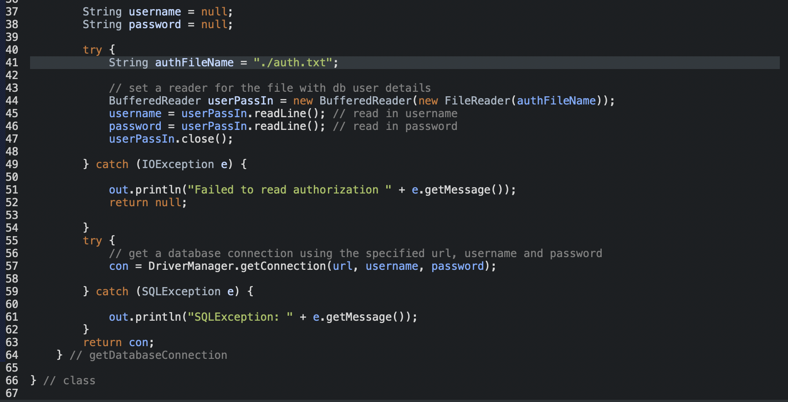

# books-loans-servlets
This project demonstrates a Tomcat 8.5 web application in the form of a book borrowing system.

## Prerequisites

Before you begin, ensure you have met the following requirements:
* You have installed the latest version of MySql(https://dev.mysql.com/downloads/mysql/). 
* You have installed at least version 8.5 of Apache Tomcat (https://tomcat.apache.org/download-80.cgi).

## Installation

Download the zip file and open the java-src directory in your chosen IDE for builds.
Deploy and rename the tomcat-deployment directory. 
I prefer to use php my admin for MySQL database management however you can use the command line to populate your
database with the commands given in the file Setup.SQL

It will also be necessary to update set up method calls within the DatabaseAccess.java file.

## Usage

After the package has been successfully deployed via Tomcat and the server has been refreshed the servlets homepage LibraryLinks.html
will be accessible via your localhost at whichever port your Tomcat if congifured to listen to for requests.
## Contributing
Pull requests are welcome. For major changes, please open an issue first to discuss what you would like to change.

Please make sure to update tests as appropriate.

## License
[GPLv3](https://choosealicense.com/licenses/gpl-3.0/)
